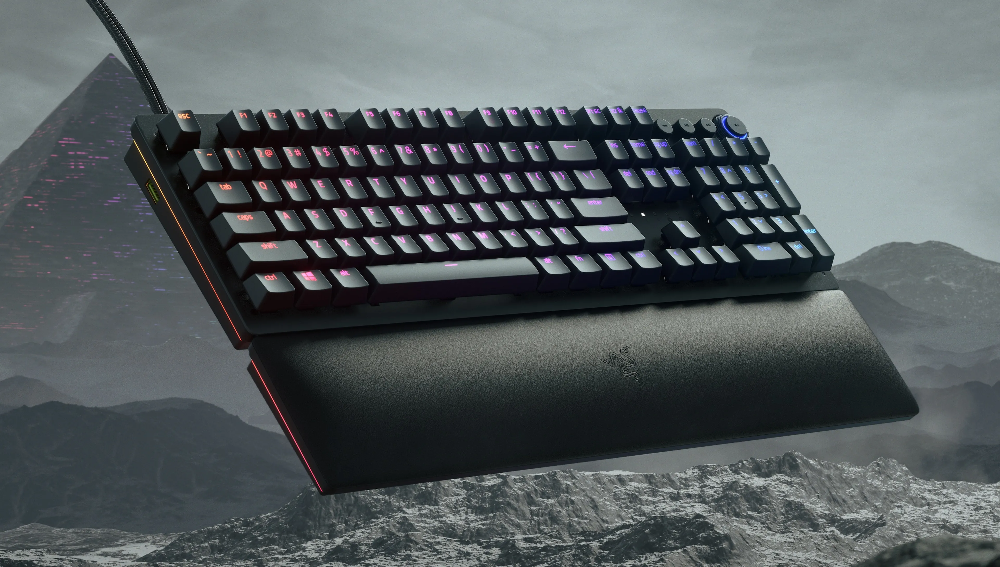

# ⌨️ FHW-Teclados ⌨️

---

---

## 🔠 [1. Definición del Períférico](descripcion.md)

## 🗒️ [2. Características Principales](caracteristicas.md)

## 🌐 [3. Tipos](tipos.md)

## ⌨️ [4. Ejemplos Comerciales](ejemplos_comerciales.md)

## 💡 [5. Conclusiones](conclusiones.md)

## 👁️‍🗨️ [6. Referencias](referencias.md)

---
## LICENCIA
Este trabajo se publica bajo la licencia Creative Commons Attribution 4.0 International (CC BY 4.0).

## AUTORES
