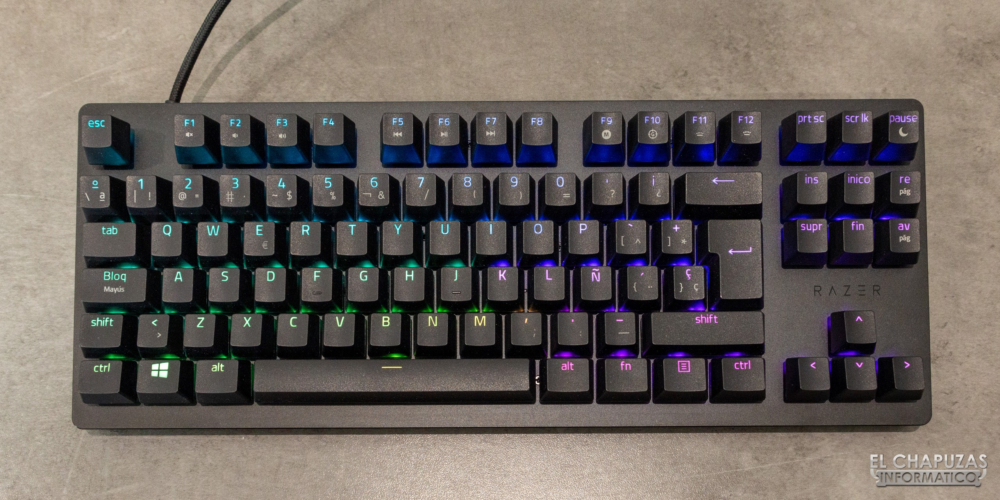
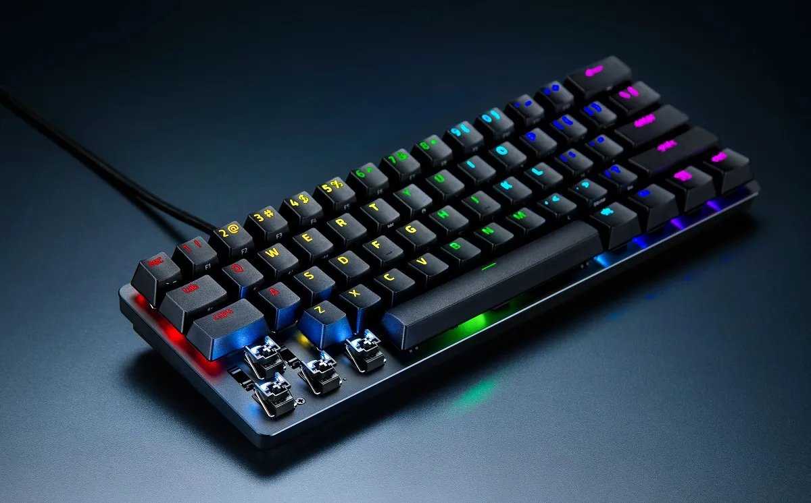

## 🗒️ Características Principales

- Permite la introducción de texto y comandos.
- Diseño estándar con teclas alfabéticas, numéricas y de función.
- Disponible en diferentes layouts según el idioma (QWERTY, AZERTY, etc.).
- Puede ser con cable (USB) o inalámbrico (Bluetooth).
- Variedad de tamaños y diseños.

  
  

