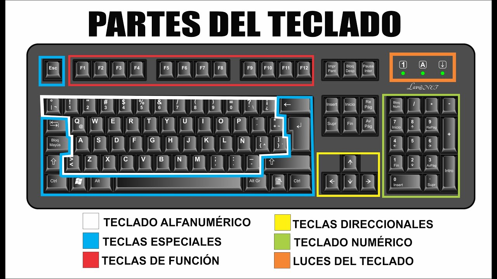

## 🔠 Definición del Períférico
---

---

Un teclado es un **dispositivo de entrada**, que utiliza teclas alfanuméricas (letras y números), direccionales (flechas arriba, abajo, derecha e izquierda), teclas especiales (tabulador, punto, coma, intro, escape, etc) y teclas de funciones (f1, f2, f3...) las cuales cumplen ciertas funciones o se combinan en conjunto para lograr una función y evitar el uso del ratón.
