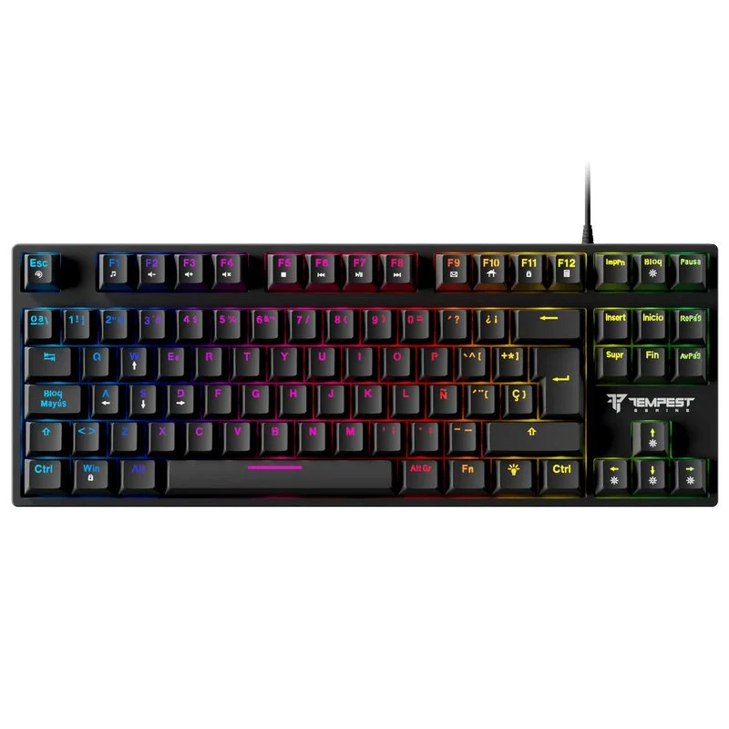
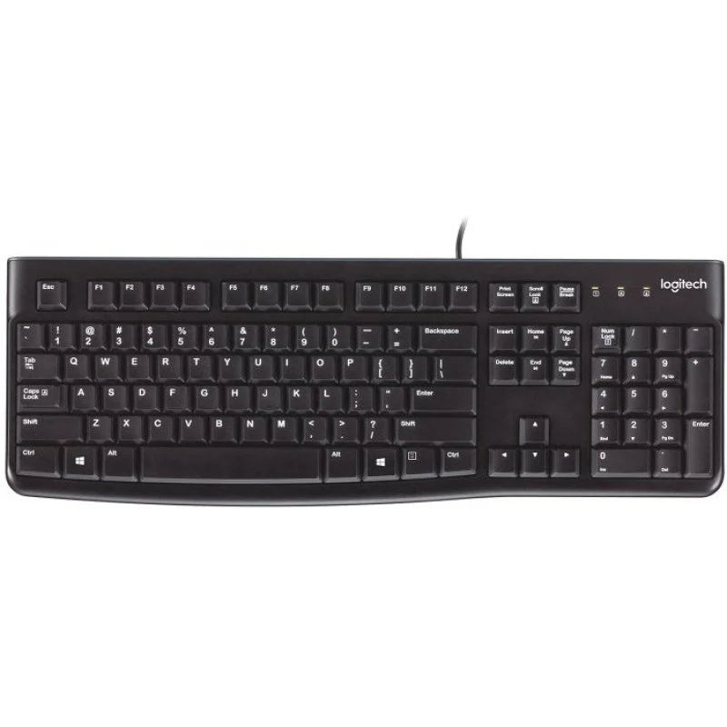
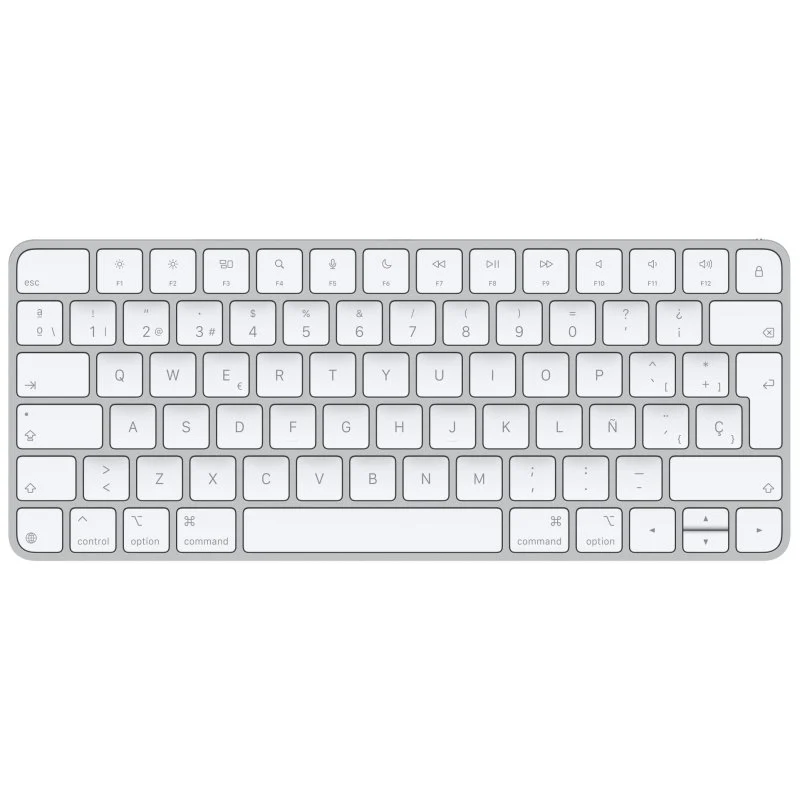
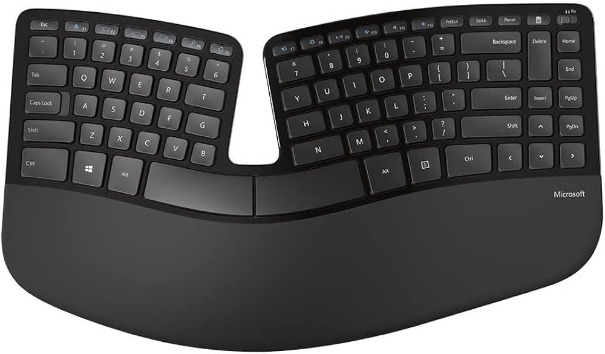

## ⌨️ [Ejemplos Comerciales](README.md)

---
| Tipo de Teclado | Modelo | Switch Utilizado | Características | Nº de pulsaciones | Precio |
|-----------------|--------|------------------|-----------------|-------------------|--------|
| Mecánico | Tempest K11 Ogre | Outemu Blue | Retroiluminación RGB, diseño robusto | 50 millones | 30 € |
| Membrana | Logitech K120 | Membrana | Diseño resistente a salpicaduras, teclas silenciosas, conexión USB | 10 millones | 12,99 € |
| Capacitivo | Apple Magic Keyboard | Tijera | Diseño compacto y ligero, batería recargable, conexión inalámbrica | 10 millones | 99 € |
| Ergonómico | Microsoft Sculpt Ergonomic Desktop | Membrana | Diseño ergonómico dividido, teclado numérico separado, conexión inalámbrica | 5 millones | 129,99 € |

---

  
  

---

  
  

