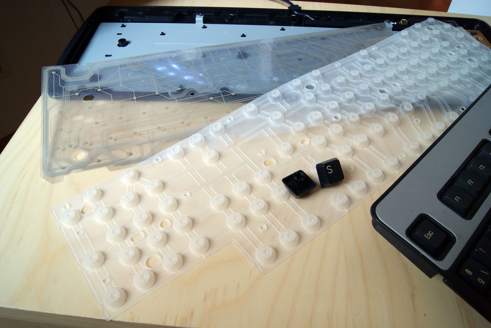
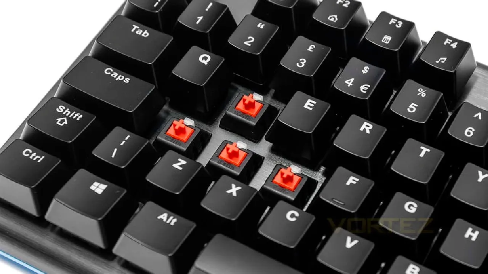
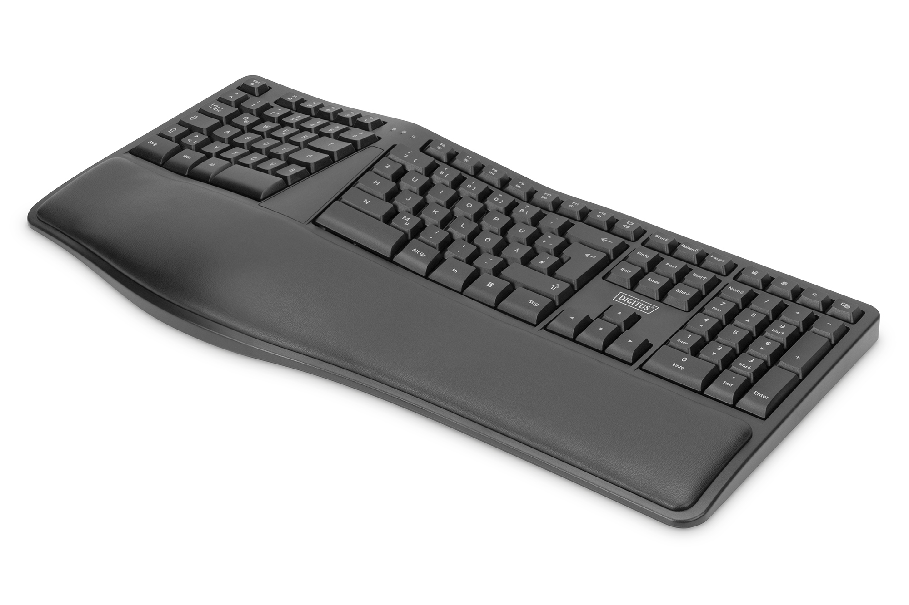
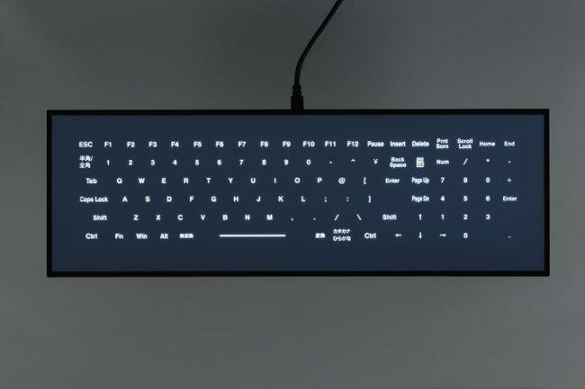
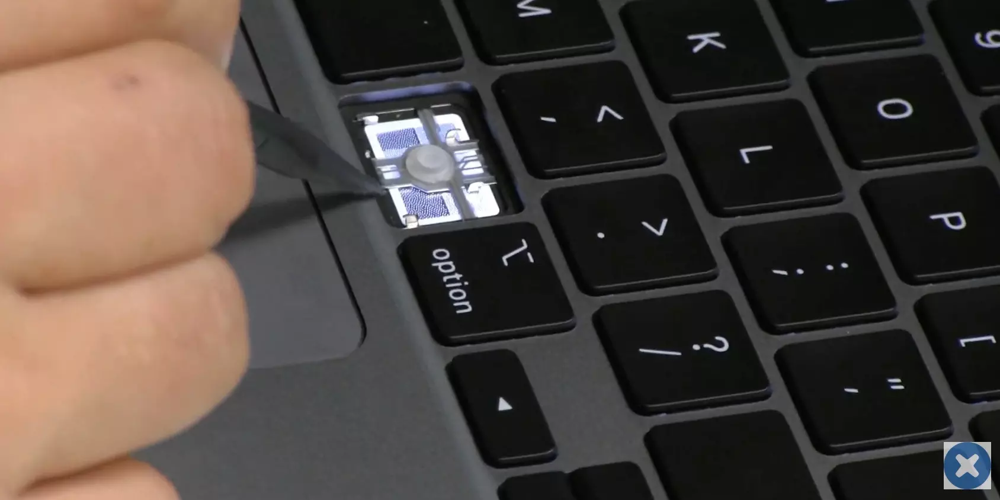

## 🌐 [Tipos de Teclado](README.md)

---
### Teclados de Membrana
Los teclados de membrana son los más familiares para la mayoría de nosotros. Cada tecla está compuesta por una **membrana** suave que se activa al presionarla. *Son silenciosos y económicos*.
- *Membranas planas*: Estos teclados utilizan una capa de membrana para registrar las pulsaciones de las teclas. Son comunes en portátiles y teclados de bajo coste. Ofrecen una experiencia de escritura suave y silenciosa, pero pueden ser menos duraderos que otros tipos.
- *Membranas de interruptor de cúpula*: Este tipo de teclado tiene una membrana debajo de cada tecla con una cúpula en el centro. Al presionar una tecla, la cúpula se deforma y registra la pulsación. Son más duraderos que los teclados de membranas planas y ofrecen una respuesta táctil distintiva.

--- 
### Teclados Mecánicos
Los teclados mecánicos son elegidos por aquellos que disfrutan de la *escritura y los juegos*. Cada tecla tiene su propio interruptor mecánico, llamados **switches**, lo que proporciona una respuesta táctil distintiva y un sonido característico al escribir. Vienen en una variedad de interruptores con diferentes colores y sonidos.
- *Interruptores lineales*: Los teclados con interruptores lineales no tienen una cúpula táctil, lo que significa que la pulsación es suave y sin resistencia. Son ideales para la escritura rápida y el juego, ya que permiten pulsaciones rápidas y precisas.
- *Interruptores táctiles*: Estos teclados proporcionan una respuesta táctil sin llegar al punto de resistencia de un interruptor de clic. Son una excelente opción para quienes buscan un equilibrio entre una pulsación suave y una retroalimentación táctil.
- *Interruptores de clic*: Los teclados con interruptores de clic emiten un sonido audible y una respuesta táctil distintiva con cada pulsación. Son populares entre los escritores que disfrutan de un retorno táctil vívido.

---
### Teclado Ergonómico
Diseñados para **reducir la tensión en las manos y muñecas**, suelen estar divididos en secciones y con una inclinación. *Favorecen la comodidad y pueden ayudar a prevenir lesiones* por esfuerzo repetitivo. Pueden requerir tiempo para acostumbrarse a su disposición.

---
### Teclados Capacitivos
Utilizan tecnología capacitiva para **detectar el toque de los dedos sin necesidad de presionar las teclas**. *Duraderos y resistentes al polvo*, ideales para entornos sucios.

---
### Teclados de Tijera
Comunes en los ordenadores portátiles, los teclados de tijera ofrecen una experiencia de *escritura más delgada y silenciosa*. Utilizan un mecanismo de tijera para activar las teclas y son ideales para la portabilidad.

---
### Teclados Custom
Son aquellos teclados que cada usuario lo monta desde cero, personalizando cada pieza, ya sea chasis, switches, teclas, placa, etc. Son bastante caros ya que cada teclado puede ser único. Suelen ser mecánicos

---
### ⌨️ [4. Ejemplos Comerciales](ejemplos_comerciales.md)
